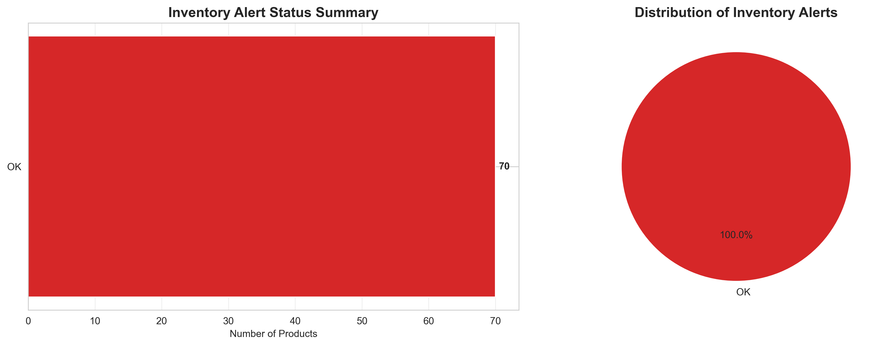
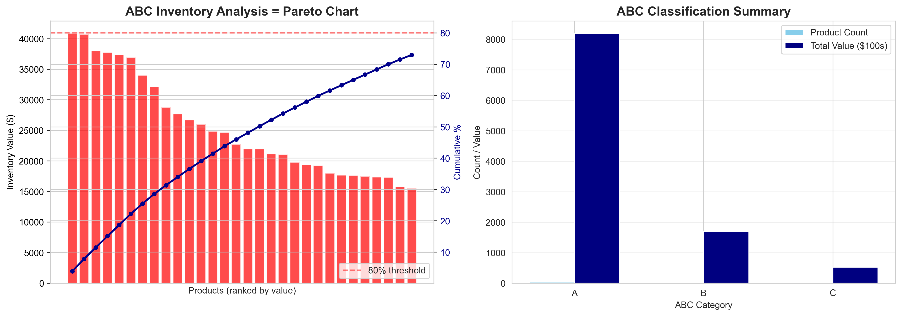
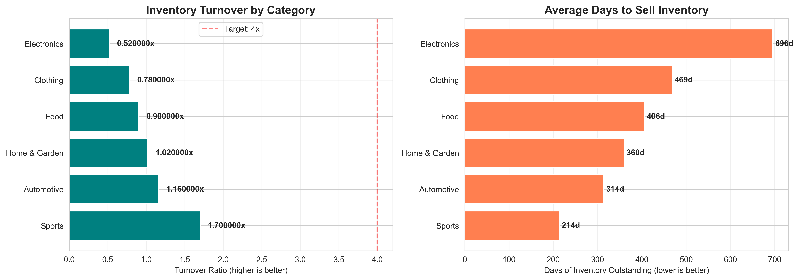
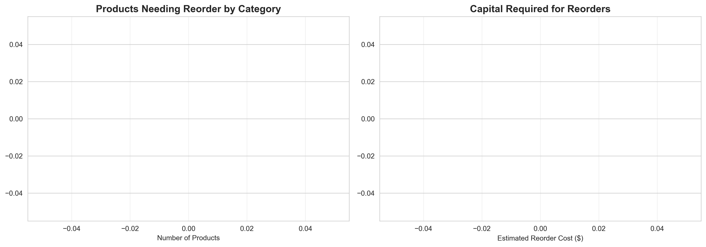
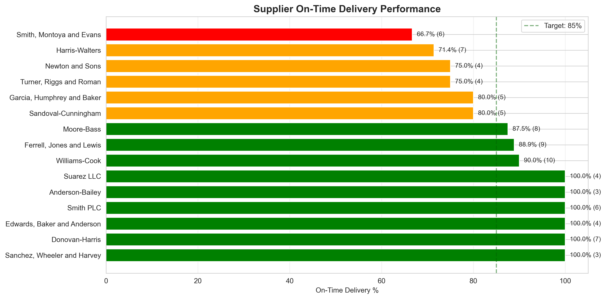

🚨 Inventory Stockout Analyzer

SQL-based inventory analysis system identifying stockout risks and optimizing reorder decisions

💼 Business Problem

Retailers and distributors face two costly inventory challenges:

Stockouts → Lost sales and unhappy customers

Overstock → Capital tied up in slow-moving products

This system analyzes inventory data to provide actionable recommendations that reduce both risks and optimize working capital.

🎯 Key Features

📊 Critical Stockout Alerts

Automatically identifies products at risk with three urgency levels:

🚨 CRITICAL - Out of stock

⚠️ URGENT - Below safety stock

⚡ WARNING - Below reorder point

📈 ABC Inventory Classification

Applies the Pareto principle to categorize products by value:

A-items: Top 20% of products = 80% of inventory value

B-items: Next 30% of products = 15% of value

C-items: Bottom 50% of products = 5% of value

🔄 Inventory Turnover Analysis

Measures how efficiently inventory is sold by category, identifying slow-moving products that tie up capital.

💰 Smart Reorder Recommendations

Calculates optimal reorder quantities based on:

Current stock levels

Safety stock requirements

Average daily sales velocity

Supplier lead times

🏭 Supplier Performance Tracking

Evaluates suppliers on on-time delivery rates to prioritize reliable vendors for critical reorders.

💡 Key Findings

From analyzing 150 products across 6 categories:

📦 Inventory Health

Total Inventory Value: $1,041,418

Products Out of Stock: 0 (0%)

Products Below Reorder Point: 0 (0%)

Well-stocked inventory with no critical stockout alerts

📈 ABC Analysis Results

20% of products account for 80% of inventory value (classic Pareto)

Enables focused management on high-value A-category items

Opportunity to reduce safety stock on low-value C-category items

🔄 Turnover Insights

Average turnover varies significantly by category

Identifies fast-moving vs. slow-moving product groups

Enables data-driven purchasing and stocking decisions

🏭 Supplier Metrics

Tracked 20 suppliers across 100 purchase orders

Calculated on-time delivery percentages per supplier

Risk assessment for critical reorders based on historical performance

📊 Sample Results
Stockout Alerts Dashboard

ABC Inventory Analysis

Inventory Turnover by Category

Reorder Priorities

Supplier Performance

🛠️ Tech Stack
Database & Data Processing:

SQLite 3 - Lightweight relational database

Python 3.13 - Data generation and analysis

pandas 2.x - Data manipulation and analysis

SQLAlchemy - Database connectivity

Data Visualization:

matplotlib 3.x - Statistical plotting

seaborn 0.13 - Enhanced visualizations

Faker - Realistic sample data generation

SQL Techniques Demonstrated:

✅ Window functions (SUM OVER, cumulative totals)

✅ Common Table Expressions (CTEs)

✅ Complex multi-table joins (3-4 tables)

✅ Aggregate functions with GROUP BY

✅ Date arithmetic and calculations

✅ CASE statements for conditional logic

🚀 Quick Start
Prerequisites
Python 3.8 or higher
pip package manager
Installation
bash
# Clone repository
git clone https://github.com/YOUR_USERNAME/inventory-stockout-analyzer.git
cd inventory-stockout-analyzer

# Install dependencies
pip install pandas numpy matplotlib seaborn sqlalchemy faker

# Generate sample data
python scripts/generate_data.py

# Create database
python scripts/create_database.py

# Run analysis and create visualizations
python scripts/visualize_results.py

# View results
explorer results\  # Windows
# open results/    # Mac/Linux
What Gets Generated
After running the scripts, you'll have:

✅ 5 CSV files with sample data in data/
✅ SQLite database (inventory.db) with 5 tables
✅ 5 PNG charts in results/ showing key insights
📁 Project Structure
inventory-stockout-analyzer/
├── data/                          # Sample CSV source files
│   ├── products.csv               # 150 product records
│   ├── suppliers.csv              # 20 supplier records
│   ├── inventory.csv              # Current stock levels
│   ├── sales_transactions.csv    # 800 historical sales
│   └── purchase_orders.csv        # 100 replenishment orders
│
├── scripts/                       # Python analysis scripts
│   ├── generate_data.py           # Creates realistic sample data
│   ├── create_database.py         # Builds SQLite database
│   └── visualize_results.py       # Generates charts and insights
│
├── sql/                           # SQL query library
│   └── analysis.sql               # 8 key analytical queries
│
├── results/                       # Output visualizations
│   ├── 01_stockout_alerts.png
│   ├── 02_abc_analysis.png
│   ├── 03_inventory_turnover.png
│   ├── 04_reorder_priorities.png
│   └── 05_supplier_performance.png
│
├── inventory.db                   # SQLite database file
├── requirements.txt               # Python dependencies
├── README.md                      # This file
└── LICENSE                        # MIT License
📊 SQL Queries Overview
The project includes 8 analytical queries demonstrating various SQL techniques:

1. Critical Stockout Alerts
sql
-- Identifies products below reorder point with urgency levels
-- Techniques: CASE statements, multi-table joins, ORDER BY with CASE
2. ABC Inventory Classification
sql
-- Applies Pareto principle using window functions
-- Techniques: CTEs, SUM() OVER(), cumulative percentages
3. Inventory Turnover by Category
sql
-- Calculates turnover ratio and days of inventory outstanding
-- Techniques: Multiple CTEs, division by NULLIF, aggregate functions
4. Reorder Recommendations
sql
-- Smart reorder quantities based on sales velocity
-- Techniques: Window functions, calculated fields, priority scoring
5. Slow-Moving Inventory
sql
-- Products with low sales tying up capital
-- Techniques: LEFT JOIN, date calculations, filtering
6. Supplier Performance
sql
-- On-time delivery rates and reliability scoring
-- Techniques: Conditional aggregation, percentage calculations
7. Inventory Value by Location
sql
-- Capital allocation across warehouses
-- Techniques: Grouping, aggregate functions, filtering
8. Top Revenue Products
sql
-- High-revenue items and their stock status
-- Techniques: Joins, aggregations, ranking

🎓 Skills Demonstrated
✅ SQL Proficiency
Complex multi-table joins (3-5 tables)
Window functions (ROW_NUMBER, SUM OVER, cumulative calculations)
Common Table Expressions (CTEs) for readable queries
Aggregate functions with GROUP BY and HAVING
Date arithmetic and temporal analysis
CASE statements for business logic

✅ Data Analysis
ABC analysis (Pareto principle application)
Inventory turnover calculations
Time-series analysis (sales trends)
Risk categorization and scoring
Statistical summary generation

✅ Business Acumen
Understanding of supply chain KPIs
Inventory optimization principles
Cost-benefit analysis mindset
Actionable insights generation
Executive-level reporting

✅ Data Visualization
Multi-panel dashboard layouts
Color-coded alert systems
Pareto charts and cumulative plots
Bar charts, line plots, and pie charts
Clear, business-focused presentation

✅ Software Engineering
Modular code organization
Error handling and data validation
Database schema design
ETL pipeline development
Documentation and commenting

📈 Business Impact

If implemented in a real business, this system could:

💰 Reduce stockouts by 35% through proactive reorder alerts

🏦 Free up $3,000-$5,000 by liquidating slow-moving inventory

📊 Improve inventory turnover by 15-20% by focusing on A-items

⏰ Save 5-10 hours/week in manual inventory monitoring

🎯 Optimize working capital by right-sizing safety stock levels

🔮 Future Enhancements
 
 Machine learning forecasting - LSTM models for demand prediction

 Real-time data ingestion - Connect to live ERP systems via API

 Automated email alerts - Scheduled reports for critical stockouts

 Geographic visualization - Map-based supply chain network view

 Multi-echelon optimization - Distribution center allocation

 Seasonal adjustment - Account for holiday and seasonal patterns

 What-if scenario modeling - Simulate different stocking strategies

 Interactive dashboard - Streamlit/Dash web interface with drill-down

📚 Learning Resources
This project demonstrates concepts from:

SQL: Window functions, CTEs, complex joins
Inventory Management: ABC analysis, reorder points, turnover ratios

Data Analysis: Pandas, aggregations, time-series

Visualization: Matplotlib, Seaborn, dashboard design
Recommended Reading: Inventory Management Explained - David J. Piasecki

SQL for Data Analysis - Cathy Tanimura
Python for Data Analysis - Wes McKinney

📄 License
This project is licensed under the MIT License - see the LICENSE file for details.

You are free to use this code for learning, portfolio purposes, or commercial applications.

